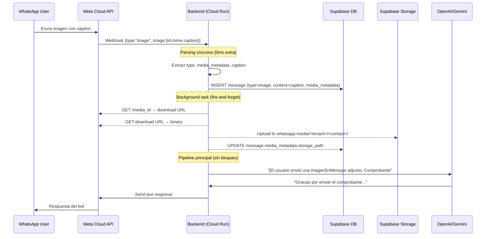

# Implementación de Media Handling — WhatsApp Cloud API

## Problema

Control Pest recibirá **comprobantes de pago** de sus clientes vía WhatsApp. Actualmente el pipeline (`ProcessMessageUseCase.execute`) **solo extrae `message.text.body`** (línea 96) y silenciosamente ignora cualquier mensaje que no sea texto — imágenes, documentos, audios y videos llegan como payloads vacíos (`text_body = ""`) que el LLM recibe sin contexto.

## Documentación Consultada

| Fuente | Sección | URL |
|:---|:---|:---|
| Meta Cloud API v25.0 | Webhooks — Messages Object | [components#messages-object](https://developers.facebook.com/docs/whatsapp/cloud-api/webhooks/components#messages-object) |
| Meta Cloud API v25.0 | Media Reference (Upload/Download) | [reference/media](https://developers.facebook.com/docs/whatsapp/cloud-api/reference/media) |
| Supabase | Storage Buckets Fundamentals | [storage/buckets/fundamentals](https://supabase.com/docs/guides/storage/buckets/fundamentals) |
| Supabase | Storage Access Control (RLS) | [storage/security/access-control](https://supabase.com/docs/guides/storage/security/access-control) |
| Supabase | Storage Helper Functions | [storage/schema/helper-functions](https://supabase.com/docs/guides/storage/schema/helper-functions) |

---

## Análisis Técnico: Estructura del Webhook por Tipo

Cuando Meta entrega un mensaje **no textual**, el payload cambia:

```json
// IMAGEN (comprobante foto)
{
  "type": "image",
  "image": {
    "id": "<MEDIA_ID>",
    "mime_type": "image/jpeg",
    "sha256": "<HASH>",
    "caption": "Comprobante de transferencia"
  }
}

// DOCUMENTO (comprobante PDF)
{
  "type": "document",
  "document": {
    "id": "<MEDIA_ID>",
    "mime_type": "application/pdf",
    "sha256": "<HASH>",
    "filename": "comprobante.pdf",
    "caption": "Pago realizado"
  }
}

// AUDIO (nota de voz)
{
  "type": "audio",
  "audio": {
    "id": "<MEDIA_ID>",
    "mime_type": "audio/ogg; codecs=opus"
  }
}

// VIDEO
{
  "type": "video",
  "video": {
    "id": "<MEDIA_ID>",
    "mime_type": "video/mp4",
    "sha256": "<HASH>"
  }
}

// STICKER
{
  "type": "sticker",
  "sticker": {
    "id": "<MEDIA_ID>",
    "mime_type": "image/webp",
    "animated": false
  }
}

// LOCATION
{
  "type": "location",
  "location": {
    "latitude": -33.4489,
    "longitude": -70.6693,
    "name": "Santiago",
    "address": "Providencia, Santiago"
  }
}

// REACTION (emoji a un mensaje)
{
  "type": "reaction",
  "reaction": {
    "message_id": "wamid.xxx",
    "emoji": "👍"
  }
}
```

### Flujo para descargar media de Meta (2 pasos)

1. **GET** `https://graph.facebook.com/v25.0/<MEDIA_ID>?phone_number_id=<PHONE_ID>` → retorna `{ url, mime_type, sha256, file_size }`
2. **GET** `<url>` con `Authorization: Bearer <TOKEN>` → retorna el binario

> [!CAUTION]
> La URL de descarga de Meta **expira en ~5 minutos**. El download debe ser inmediato.

---

## User Review Required

> [!IMPORTANT]
> **Decisión arquitectónica: ¿Dónde almacenamos los archivos?**
> 
> **Opción recomendada: Supabase Storage** — ya tenemos el SDK (`supabase>=2.3.6`), usamos `service_role` key desde el backend que bypasea RLS, y el frontend ya renderiza desde Supabase. El costo es $0 adicional (1GB incluido en plan Free, 100GB en Pro).
> 
> Alternativa descartada: guardar solo metadata/URL de Meta (URLs expiran en 5 min).

> [!WARNING]
> **Latencia en el pipeline de respuestas:**
> La descarga de media de Meta + upload a Supabase Storage ocurriría **ANTES** del LLM call. Para evitar bloquear la respuesta del asistente, proponemos un diseño fire-and-forget donde:
> 1. Extraemos tipo + caption **síncronamente** (0ms extra, es parsing de JSON)
> 2. Persistimos el mensaje con metadata en DB **síncronamente** (ya lo hacemos)
> 3. El **download + upload a Storage corre en background** (asyncio.create_task), sin bloquear el LLM
> 4. Al LLM le pasamos: `[El usuario envió una imagen con la nota: "Comprobante de transferencia"]` — no necesita ver el binario

---

## Proposed Changes

### Fase 1: Database Schema (Migration)

#### [MODIFY] `messages` table — agregar columnas de media

```sql
-- Migration: add_media_columns_to_messages
ALTER TABLE public.messages
  ADD COLUMN IF NOT EXISTS message_type text NOT NULL DEFAULT 'text'
    CHECK (message_type IN ('text','image','document','audio','video','sticker','location','reaction','unsupported')),
  ADD COLUMN IF NOT EXISTS media_metadata jsonb DEFAULT NULL;

COMMENT ON COLUMN public.messages.message_type IS 
  'Type of WhatsApp message: text, image, document, audio, video, sticker, location, reaction, unsupported';
COMMENT ON COLUMN public.messages.media_metadata IS 
  'Media details: {media_id, mime_type, sha256, filename, caption, file_size, storage_path, storage_url, download_status}';
```

**Justificación del diseño:**
- `message_type` como columna indexada permite filtrar/buscar por tipo
- `media_metadata` como `jsonb` es flexible para diferentes tipos sin schema explosion
- NO necesitamos una tabla separada `media_attachments` — el ratio es 1:1 (un mensaje = un attachment en WhatsApp)
- `storage_path` dentro del jsonb referencia la ubicación en Supabase Storage

---

### Fase 2: Supabase Storage Bucket

#### [NEW] Bucket `whatsapp-media` — configuración

```sql
-- Crear bucket privado con tenant isolation via path
INSERT INTO storage.buckets (id, name, public, file_size_limit, allowed_mime_types)
VALUES (
  'whatsapp-media',
  'whatsapp-media',
  false,  -- PRIVADO: requiere signed URL o service_role para acceso
  20971520,  -- 20MB (Meta limit para video es 16MB, doc es 100MB, damos margen)
  ARRAY[
    'image/jpeg', 'image/png', 'image/webp',
    'application/pdf',
    'application/vnd.ms-excel',
    'application/vnd.openxmlformats-officedocument.spreadsheetml.sheet',
    'audio/ogg', 'audio/mpeg', 'audio/amr', 'audio/mp4',
    'video/mp4', 'video/3gpp'
  ]
);
```

**Path convention para tenant isolation:**
```
whatsapp-media/<tenant_id>/<contact_id>/<timestamp>_<media_id>.<ext>
```

**RLS policies en `storage.objects`:**
```sql
-- Backend usa service_role → bypasea RLS por completo (según docs Supabase)
-- Para frontend: signed URLs generadas por el backend

-- Policy para dashboard: authenticated users can read media de su tenant
CREATE POLICY "Tenant users can view their tenant media"
ON storage.objects FOR SELECT TO authenticated
USING (
  bucket_id = 'whatsapp-media' AND
  (storage.foldername(name))[1] IN (
    SELECT t.id::text FROM tenants t
    JOIN tenant_users tu ON tu.tenant_id = t.id
    WHERE tu.user_id = auth.uid()
  )
);

-- Superadmin can view all
CREATE POLICY "Superadmin can view all media"
ON storage.objects FOR SELECT TO authenticated
USING (
  bucket_id = 'whatsapp-media' AND
  (SELECT is_superadmin())
);
```

---

### Fase 3: Backend — Media Extraction (Zero Latency)

#### [MODIFY] [use_cases.py](file:///D:/WebDev/IA/Backend/app/modules/communication/use_cases.py)

**Cambio 1: Extraer tipo y metadata del webhook payload (líneas 94-96)**

```python
# ANTES (línea 94-96)
message = changes["messages"][0]
patient_phone = message.get("from")
text_body = message.get("text", {}).get("body", "")

# DESPUÉS
message = changes["messages"][0]
patient_phone = message.get("from")
message_type = message.get("type", "text")

# ============================================================
# Block M1: Media Type Detection — zero-latency extraction
# Meta webhook payload includes type-specific object:
# image.{id,mime_type,sha256,caption}
# document.{id,mime_type,sha256,filename,caption}
# audio.{id,mime_type}
# video.{id,mime_type,sha256,caption}
# sticker.{id,mime_type,animated}
# location.{latitude,longitude,name,address}
# reaction.{message_id,emoji}
# Ref: https://developers.facebook.com/docs/whatsapp/cloud-api/webhooks/components#messages-object
# ============================================================
text_body = ""
media_metadata = None

if message_type == "text":
    text_body = message.get("text", {}).get("body", "")
elif message_type in ("image", "document", "audio", "video", "sticker"):
    media_obj = message.get(message_type, {})
    media_metadata = {
        "media_id": media_obj.get("id"),
        "mime_type": media_obj.get("mime_type"),
        "sha256": media_obj.get("sha256"),
        "caption": media_obj.get("caption"),
        "filename": media_obj.get("filename"),  # documents only
        "animated": media_obj.get("animated"),  # stickers only
        "download_status": "pending",
        "storage_path": None,
    }
    # Use caption as text_body for LLM context
    text_body = media_obj.get("caption", "")
    logger.info(
        f"📎 [ORCH] Media message detected: type={message_type}, "
        f"mime={media_obj.get('mime_type')}, "
        f"media_id={media_obj.get('id', 'N/A')[:20]}..."
    )
elif message_type == "location":
    loc = message.get("location", {})
    media_metadata = {
        "latitude": loc.get("latitude"),
        "longitude": loc.get("longitude"),
        "name": loc.get("name"),
        "address": loc.get("address"),
    }
    text_body = f"📍 Ubicación: {loc.get('name', '')} {loc.get('address', '')}".strip()
elif message_type == "reaction":
    reaction = message.get("reaction", {})
    media_metadata = {
        "reacted_message_id": reaction.get("message_id"),
        "emoji": reaction.get("emoji"),
    }
    text_body = ""  # Reactions don't generate text for LLM
    logger.info(f"😊 [ORCH] Reaction received: {reaction.get('emoji')}")
    # Skip LLM processing for reactions — just persist
else:
    # Unsupported types: contacts, interactive, etc.
    message_type = "unsupported"
    text_body = ""
    logger.info(f"⚠️ [ORCH] Unsupported message type: {message.get('type')}")
```

**Cambio 2: Mensaje persistido con tipo y metadata (líneas 212-220)**

```python
# ANTES
insert_data = {
    "contact_id": contact_id, "tenant_id": tenant.id,
    "sender_role": "user", "content": text_body
}

# DESPUÉS
insert_data = {
    "contact_id": contact_id, "tenant_id": tenant.id,
    "sender_role": "user", "content": text_body,
    "message_type": message_type,
    "media_metadata": media_metadata,  # NULL for text messages
}
```

**Cambio 3: LLM recibe contexto descriptivo del media (en la sección de history/prompt)**

```python
# Construir el contenido que va al LLM para mensajes con media
def _build_llm_content_for_media(text_body: str, message_type: str, media_metadata: dict | None) -> str:
    """Build descriptive text for LLM when user sends media.
    The LLM cannot see images/files, so we describe what was sent.
    """
    if message_type == "text" or not media_metadata:
        return text_body
    
    TYPE_LABELS = {
        "image": "una imagen/foto",
        "document": "un documento",
        "audio": "un audio/nota de voz",
        "video": "un video",
        "sticker": "un sticker",
    }
    
    label = TYPE_LABELS.get(message_type, f"un archivo de tipo {message_type}")
    parts = [f"[El usuario envió {label}"]
    
    if media_metadata.get("filename"):
        parts.append(f" llamado '{media_metadata['filename']}'")
    if media_metadata.get("mime_type"):
        parts.append(f" ({media_metadata['mime_type']})")
    parts.append("]")
    
    if text_body:  # caption exists
        parts.append(f"\nMensaje adjunto: {text_body}")
    
    return "".join(parts)
```

**Cambio 4: Background download + upload a Supabase Storage (fire-and-forget)**

```python
async def _download_and_store_media(
    db, tenant, contact_id: str, message_wamid: str,
    message_type: str, media_metadata: dict
):
    """Fire-and-forget: downloads media from Meta, uploads to Supabase Storage.
    Updates the message record with storage_path on completion.
    
    This runs in the background — does NOT block the LLM response pipeline.
    """
    media_id = media_metadata.get("media_id")
    if not media_id:
        return
    
    try:
        client = MetaGraphAPIClient.get_client()
        
        # Step 1: Get download URL from Meta (expires in ~5 min)
        url_response = await client.get(
            f"{MetaGraphAPIClient.BASE_URL}/{media_id}",
            headers={"Authorization": f"Bearer {tenant.ws_token}"},
            params={"phone_number_id": tenant.ws_phone_id},
        )
        url_response.raise_for_status()
        media_url = url_response.json().get("url")
        file_size = url_response.json().get("file_size")
        
        if not media_url:
            raise ValueError(f"No URL returned for media_id={media_id}")
        
        # Step 2: Download the binary
        download_response = await client.get(
            media_url,
            headers={"Authorization": f"Bearer {tenant.ws_token}"},
        )
        download_response.raise_for_status()
        file_bytes = download_response.content
        
        # Step 3: Determine file extension from mime_type
        MIME_TO_EXT = {
            "image/jpeg": "jpg", "image/png": "png", "image/webp": "webp",
            "application/pdf": "pdf",
            "audio/ogg": "ogg", "audio/mpeg": "mp3", "audio/amr": "amr",
            "video/mp4": "mp4", "video/3gpp": "3gp",
        }
        mime = media_metadata.get("mime_type", "").split(";")[0].strip()
        ext = MIME_TO_EXT.get(mime, "bin")
        
        # Step 4: Upload to Supabase Storage
        timestamp = datetime.now(pytz.utc).strftime("%Y%m%d_%H%M%S")
        storage_path = f"{tenant.id}/{contact_id}/{timestamp}_{media_id[:12]}.{ext}"
        
        # Using service_role key bypasses Storage RLS
        await db.storage.from_("whatsapp-media").upload(
            path=storage_path,
            file=file_bytes,
            file_options={"content-type": mime},
        )
        
        # Step 5: Update the message record with storage info
        await db.table("messages").update({
            "media_metadata": {
                **media_metadata,
                "storage_path": storage_path,
                "file_size": file_size,
                "download_status": "completed",
            }
        }).eq("wamid", message_wamid).execute()
        
        logger.info(
            f"✅ [MEDIA] Stored: {storage_path} "
            f"({len(file_bytes)} bytes, {mime})"
        )
        
    except Exception as media_err:
        logger.error(f"❌ [MEDIA] Download/upload failed: {repr(media_err)}")
        sentry_sdk.set_context("media_failure", {
            "media_id": media_id,
            "message_type": message_type,
            "tenant_id": str(tenant.id),
            "contact_id": str(contact_id),
        })
        sentry_sdk.capture_exception(media_err)
        await send_discord_alert(
            title=f"❌ Media Download Failed | Tenant {tenant.id}",
            description=(
                f"Type: {message_type}\n"
                f"Media ID: {media_id[:20]}...\n"
                f"Error: {str(media_err)[:300]}"
            ),
            severity="error", error=media_err,
        )
        # Mark as failed in DB
        try:
            await db.table("messages").update({
                "media_metadata": {
                    **media_metadata,
                    "download_status": "failed",
                    "error": str(media_err)[:200],
                }
            }).eq("wamid", message_wamid).execute()
        except Exception:
            pass  # Best-effort
```

**Invocación (línea ~239, después de persistir el mensaje):**

```python
# Fire-and-forget: download media in background
if message_type in ("image", "document", "audio", "video") and media_metadata and wamid:
    asyncio.create_task(
        _download_and_store_media(db, tenant, contact_id, wamid, message_type, media_metadata)
    )
```

---

### Fase 4: Frontend — Renderizar Media en Chat

#### [MODIFY] [ChatArea.tsx](file:///D:/WebDev/IA/Frontend/components/Conversations/ChatArea.tsx)

Dentro del bubble renderer (línea ~348-350), agregar renderizado condicional:

```tsx
// ANTES (solo texto)
<div className={`${messageBubbleStyles} leading-relaxed`}>
    {formatWhatsAppMessage(m.content)}
</div>

// DESPUÉS (texto + media)
<div className={`${messageBubbleStyles} leading-relaxed`}>
    {m.message_type === 'image' && m.media_metadata?.storage_path && (
        <MediaBubble type="image" metadata={m.media_metadata} tenantId={selectedContact.tenant_id} />
    )}
    {m.message_type === 'document' && m.media_metadata?.storage_path && (
        <MediaBubble type="document" metadata={m.media_metadata} />
    )}
    {m.message_type === 'audio' && m.media_metadata?.storage_path && (
        <MediaBubble type="audio" metadata={m.media_metadata} />
    )}
    {m.message_type === 'location' && m.media_metadata && (
        <LocationBubble metadata={m.media_metadata} />
    )}
    {m.content && <div>{formatWhatsAppMessage(m.content)}</div>}
    {!m.content && m.message_type !== 'text' && !m.media_metadata?.storage_path && (
        <span className="text-xs italic opacity-60">
            📎 {m.message_type === 'image' ? 'Imagen' : m.message_type === 'document' ? 'Documento' : m.message_type} 
            {m.media_metadata?.download_status === 'pending' ? ' (descargando...)' : ' (no disponible)'}
        </span>
    )}
</div>
```

#### [NEW] `Frontend/components/Conversations/MediaBubble.tsx`

Componente para renderizar imágenes, documentos y audios con signed URLs de Supabase Storage.

---

## Diagrama de Flujo — Latencia Zero en Pipeline LLM



**Latencia añadida al pipeline de respuesta: 0ms** (media download es background).

---

## Open Questions

> [!IMPORTANT]
> **1. ¿Qué debe hacer el bot cuando recibe un comprobante?**
> ¿Solo confirmar recepción ("Comprobante recibido, lo revisaremos")? ¿O necesita validar algo del contenido? Esto afecta el system prompt de Control Pest.

> [!IMPORTANT]
> **2. ¿Bucket size limit?**
> Supabase Free: 1GB storage. Pro: 100GB. Con comprobantes de ~200KB cada uno, 1GB ≈ 5,000 comprobantes. ¿Suficiente para el corto plazo?

> [!IMPORTANT]
> **3. ¿Notas de voz?**
> Audio transcription para que el LLM entienda notas de voz requiere un paso adicional (Whisper API o similar). ¿Lo implementamos ahora o en una fase posterior?

---

## Verification Plan

### Automated Tests

1. **Unit test**: Parseo de webhook payloads con cada tipo (image, document, audio, location, reaction, sticker)
2. **Integration test**: Enviar imagen real por WhatsApp a Control Pest → verificar:
   - `messages` row tiene `message_type = 'image'` y `media_metadata.media_id` no es NULL
   - `media_metadata.download_status = 'completed'` (con retry de hasta 30s)
   - Archivo existe en Supabase Storage path
   - Bot respondió con texto descriptivo del media
3. **Latency check**: Medir tiempo desde webhook received → bot response sent. No debe exceder baseline (sin media) por más de 100ms.

### Manual Verification

1. Enviar desde WhatsApp real:
   - Una foto (jpeg)
   - Un PDF
   - Una nota de voz
   - Una ubicación
   - Un sticker
2. Verificar en CRM dashboard que cada mensaje muestra el tipo correcto
3. Verificar que imágenes se renderizan en el chat bubble
4. Verificar cross-tenant: media de Control Pest NO visible desde CasaVitaCure

### DB Verification Query
```sql
SELECT id, message_type, media_metadata->>'download_status' as status,
       media_metadata->>'storage_path' as path,
       media_metadata->>'mime_type' as mime
FROM messages 
WHERE message_type != 'text' 
ORDER BY timestamp DESC 
LIMIT 10;
```
