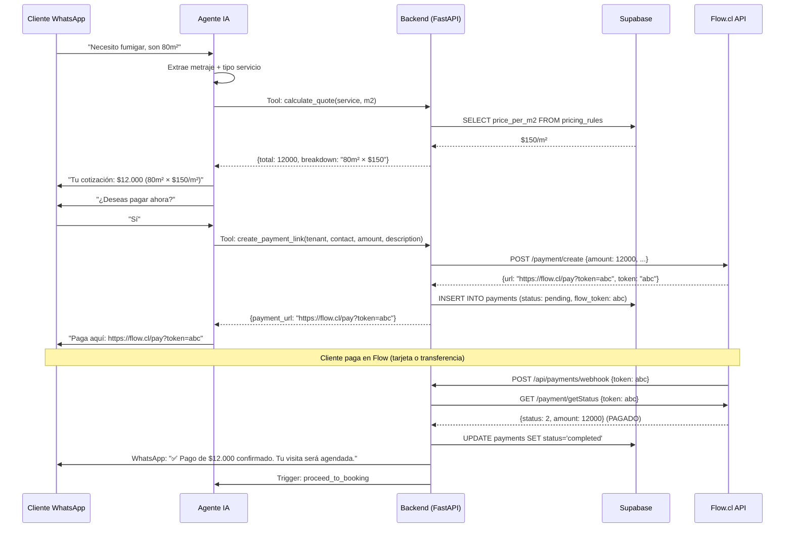

# Análisis Exhaustivo: Integración de Pagos + Auditoría de Seguridad

> **Contexto**: Control Pest necesita cobrar por servicios de fumigación con precios variables calculados por m². El agente IA de WhatsApp debe generar y enviar links de pago automáticamente. Este análisis cubre la selección del procesador de pagos y la auditoría de seguridad del sistema actual antes de manejar transacciones financieras.

---

## PARTE 1: AUDITORÍA DE SEGURIDAD DEL SISTEMA ACTUAL

> [!IMPORTANT]
> Antes de procesar pagos, el sistema debe cumplir estándares mínimos de seguridad. Esta auditoría identifica brechas que deben cerrarse ANTES de cualquier integración financiera.

### 1.1 Hallazgos Positivos ✅

| Área | Estado | Evidencia |
|---|---|---|
| **RLS (Row Level Security)** | ✅ Habilitado en TODAS las tablas | 13/13 tablas con `rls_enabled: true` |
| **RLS Policies** | ✅ Granulares por tenant | Cada tabla tiene SELECT/INSERT/UPDATE/DELETE scoped a `tenant_users.user_id = auth.uid()` |
| **Webhook HMAC** | ✅ Implementado correctamente | `security.py` usa `hmac.compare_digest()` (timing-safe) con HMAC-SHA256 |
| **CORS** | ✅ Whitelist explícita | Solo `dash.tuasistentevirtual.cl`, `ohno.tuasistentevirtual.cl`, y worker URL |
| **Rate Limiting** | ✅ Implementado | 20 LLM calls/contact/hour sliding window con alertas a 3 canales |
| **Error Handling** | ✅ 3 canales en cada except | Logger + Sentry + Discord en los archivos auditados |
| **Sentry** | ✅ 100% traces | `traces_sample_rate=1.0`, `send_default_pii=True`, environment tags |
| **Secrets** | ✅ pydantic_settings | Todos los secretos via env vars, no hardcoded |
| **Global Exception Handler** | ✅ Doble catch-all | `AppBaseException` handler + fallback `Exception` handler, ambos con Sentry + Discord |
| **Correlation IDs** | ✅ Middleware | `asgi-correlation-id` para trazabilidad request-level |
| **SQL Injection** | ✅ No vulnerable | Todo el acceso a DB via Supabase Python client (parameterized queries), NO raw SQL |

### 1.2 Vulnerabilidades y Brechas Encontradas 🔴🟡

#### 🔴 CRÍTICA — SEC-1: Webhook Signature Middleware Fail-Open

**Archivo**: [main.py](file:///D:/WebDev/IA/Backend/app/main.py#L199-L201)

```python
# Fail OPEN in case of middleware crash (don't block legitimate traffic)
# This is a conscious trade-off: availability > security during middleware bugs
pass
```

**Riesgo**: Si el middleware de verificación de firma crashea, el request pasa SIN verificación. Un atacante podría inyectar webhooks falsos si encuentra un edge case que crashee el middleware.

**Remediación**: Para pagos, cambiar a **fail-CLOSED**. Si la verificación falla, rechazar con 500:
```python
return StarletteJSONResponse(status_code=500, content={"error": "Signature verification error"})
```

**Nivel de riesgo para pagos**: 🔴 CRÍTICO — Un webhook falso podría marcar un pago como completado sin que realmente lo sea.

---

#### 🔴 CRÍTICA — SEC-2: META_APP_SECRET Soft Mode

**Archivo**: [security.py](file:///D:/WebDev/IA/Backend/app/core/security.py#L70-L75)

```python
if not app_secret:
    logger.warning("⚠️ META_APP_SECRET not configured — verification SKIPPED")
    return True  # ← PELIGROSO
```

**Riesgo**: Si `META_APP_SECRET` no está configurada en el env, TODOS los webhooks pasan sin verificación.

**Remediación**: Verificar que `META_APP_SECRET` esté configurado en PROD. Si no lo está, es urgente configurarlo YA.

**Verificación necesaria**: Confirmar en Cloud Run env vars que `META_APP_SECRET` tiene valor.

---

#### 🟡 MEDIA — SEC-3: INSERT RLS Policies sin WITH CHECK

**Tablas afectadas**: `contacts`, `messages`, `appointments`, `resources`, `scheduling_config`, `tenant_services`

Las políticas de INSERT tienen `qual: null`, lo que significa que **cualquier usuario autenticado puede insertar filas para CUALQUIER tenant_id**, no solo el suyo. Esto es una brecha de cross-tenant data injection.

**Ejemplo**: Un usuario del Tenant A podría insertar mensajes con `tenant_id` del Tenant B.

**Remediación**: Agregar `WITH CHECK (tenant_id IN (SELECT get_user_tenant_ids()))` a todas las INSERT policies.

**Nivel de riesgo para pagos**: 🟡 MEDIO — Un tenant malicioso podría crear registros de pago falsos en otro tenant.

---

#### 🟡 MEDIA — SEC-4: Endpoint `/api/simulate` sin autenticación

**Archivo**: [main.py](file:///D:/WebDev/IA/Backend/app/main.py#L311-L373)

El endpoint `/api/simulate` ejecuta `ProcessMessageUseCase` con un tenant arbitrario. No tiene ningún middleware de autenticación. Cualquiera con la URL podría simular messages.

**Remediación**: Agregar auth check (superadmin only) o eliminar de producción.

---

#### 🟡 MEDIA — SEC-5: Endpoint `/api/test-feedback` sin autenticación

**Archivo**: [main.py](file:///D:/WebDev/IA/Backend/app/main.py#L375-L396)

Similar al anterior — acepta cualquier payload sin verificar identidad.

---

#### 🟡 MEDIA — SEC-6: Supabase Linter Warnings

Del Supabase Advisor scan:

| Warning | Detalle | Remediación |
|---|---|---|
| `function_search_path_mutable` | `acquire_processing_lock` y `update_contacts_updated_at` no tienen `search_path` fijo | [Docs](https://supabase.com/docs/guides/database/database-linter?lint=0011_function_search_path_mutable) |
| `extension_in_public` | `btree_gist` instalada en schema `public` | Mover a schema `extensions` |
| `auth_leaked_password_protection` | Protección de contraseñas filtradas DESHABILITADA | [Habilitar](https://supabase.com/docs/guides/auth/password-security#password-strength-and-leaked-password-protection) |

---

#### 🟢 BAJA — SEC-7: `allow_headers=["*"]` en CORS

Permite cualquier header custom. Recomendable restringir a headers conocidos: `Content-Type, Authorization, X-Request-ID`.

---

#### 🟢 BAJA — SEC-8: Sin CSP (Content Security Policy)

El backend no envía headers de seguridad como `Content-Security-Policy`, `X-Content-Type-Options`, `X-Frame-Options`. Esto es responsabilidad del frontend (Cloudflare Pages), pero vale verificarlo.

---

### 1.3 Checklist Pre-Pagos

| # | Acción | Prioridad | Estado |
|---|---|---|---|
| 1 | Cambiar webhook middleware a fail-CLOSED | 🔴 Antes de pagos | ⏳ |
| 2 | Verificar `META_APP_SECRET` en PROD env | 🔴 Antes de pagos | ⏳ |
| 3 | Agregar `WITH CHECK` a INSERT RLS policies | 🟡 Sprint 1 pagos | ⏳ |
| 4 | Proteger `/api/simulate` con auth | 🟡 Sprint 1 pagos | ⏳ |
| 5 | Proteger `/api/test-feedback` con auth | 🟡 Sprint 1 pagos | ⏳ |
| 6 | Habilitar leaked password protection | 🟡 Sprint 1 pagos | ⏳ |
| 7 | Fijar `search_path` en funciones | 🟢 Post-lanzamiento | ⏳ |
| 8 | Mover `btree_gist` a schema `extensions` | 🟢 Post-lanzamiento | ⏳ |

---

## PARTE 2: ANÁLISIS COMPARATIVO DE PROCESADORES DE PAGO EN CHILE

### 2.1 Candidatos Evaluados

| # | Procesador | Tipo | Status Chile |
|---|---|---|---|
| 1 | **Flow.cl** | Agregador de pagos chileno | ✅ Nativo |
| 2 | **Mercado Pago** | Fintech regional (MercadoLibre) | ✅ Nativo |
| 3 | **Transbank (Webpay)** | Procesador bancario tradicional | ✅ Nativo |
| 4 | **Khipu** | Transferencia bancaria P2B | ✅ Nativo |
| ~~5~~ | ~~**Stripe**~~ | ~~Fintech global~~ | ❌ **No opera en Chile** |

> [!WARNING]
> **Stripe queda DESCARTADO.** No permite crear cuentas merchant para empresas constituidas en Chile. Requeriría una entidad legal en EEUU (via Stripe Atlas), lo cual no es viable para Control Pest.

---

### 2.2 Matriz Comparativa Exhaustiva

| Dimensión | Flow.cl 🏆 | Mercado Pago | Transbank | Khipu |
|---|---|---|---|---|
| **API REST** | ✅ Completa | ✅ Completa | ✅ SDK Python | ✅ v2 REST |
| **Python SDK** | ❌ No oficial (requests+hmac) | ✅ `pip install mercadopago` | ✅ `pip install transbank-sdk` | ⚠️ `pip install pykhipu` (community) |
| **Payment Links dinámicos** | ✅ `payment/create` → URL | ✅ `preference().create()` → `init_point` | ⚠️ Webpay Plus crea TX, no links nativos | ❌ Solo transferencia bancaria |
| **Monto variable** | ✅ Param `amount` por request | ✅ Param `unit_price` por request | ✅ Param `amount` por TX | ✅ Param `amount` |
| **Webhooks** | ✅ `urlConfirmation` + `POST` con token | ✅ `notification_url` + IPN | ✅ Return URL + confirm | ✅ `notify_url` |
| **PCI DSS** | ✅ **Nivel 1** (máximo) | ✅ Cumple PCI DSS | ✅ Cumple (es Transbank) | N/A (no maneja tarjetas) |
| **Sandbox/Testing** | ✅ `sandbox.flow.cl` separado | ✅ Tarjetas de prueba | ✅ Ambiente de integración | ⚠️ Limitado |
| **Métodos de pago** | Tarjetas (Webpay), transferencia, Mach, OnePay, Servipag | Tarjetas, saldo MP, Khipu, otros | Tarjetas crédito/débito solamente | Solo transferencia bancaria |
| **Costos fijos** | ❌ $0 | ❌ $0 | ⚠️ Puede tener contrato | ❌ $0 |
| **Comisión tarjeta** | 2.89% + IVA (3 días) | ~3.49% + IVA (varía) | Variable por rubro (~2.5-3.5%) | N/A |
| **Comisión transferencia** | 0.99% + IVA + $100 CLP | N/A directo | N/A | ~1% + IVA |
| **Tiempo implement.** | 🟢 2-3 días | 🟢 1-2 días | 🟡 5-7 días (contrato) | 🟡 3-5 días |
| **Contrato requerido** | ❌ No | ❌ No | ✅ Sí (acuerdo comercial) | ❌ No |
| **Flujo en WhatsApp** | Bot genera link → cliente paga → webhook confirma | Bot genera link → cliente paga → webhook confirma | Bot genera link → cliente paga → callback confirma | Bot genera link → cliente transfiere → webhook confirma |

---

### 2.3 Análisis Profundo por Vendor

#### 🥇 FLOW.CL — Recomendación Principal

**Documentación oficial**: [flow.cl/docs/api.html](https://www.flow.cl/docs/api.html)

**¿Por qué Flow para nuestro caso?**

1. **PCI DSS Nivel 1** — El estándar más alto de seguridad en pagos. Solicitable su AOC (Attestation of Compliance) a `soporte@flow.cl`.

2. **Payment Links nativos** — `POST /payment/create` devuelve una URL que el bot puede enviar por WhatsApp inmediatamente. No requiere redirect desde nuestro backend.

3. **Multi-método de pago** — El cliente de Control Pest elige cómo pagar:
   - Tarjeta (crédito/débito via Webpay integrado)
   - Transferencia bancaria (via Khipu/Etpay integrado — ¡comisión 0.99%!)
   - Mach / OnePay / Servipag

4. **Sin contrato ni costos fijos** — $0 setup, $0 mensual. Solo comisión por venta.

5. **Webhook confiable** — `urlConfirmation` recibe POST con token → llamamos `GET /payment/getStatus` para confirmar.

**Flujo técnico para nuestro agente:**

```
Cliente: "Necesito fumigar 80 m²"
    ↓
Agente IA calcula: 80m² × $X/m² = $Y
    ↓
Backend: POST flow.cl/api/payment/create { amount: Y, subject: "Fumigación 80m²" }
    ↓
Flow devuelve: { url: "https://www.flow.cl/pay?token=xyz", token: "xyz" }
    ↓
Agente envía por WhatsApp: "Tu cotización es $Y. Paga aquí: [link]"
    ↓
Cliente paga en Flow (tarjeta O transferencia)
    ↓
Flow → POST webhook → Backend verifica → Confirma al cliente
```

**Autenticación API**: HMAC-SHA256 (ya tenemos experiencia con esto en el webhook de Meta).

**Ejemplo de firma:**
```python
import hmac, hashlib

params_sorted = sorted(params.items())  # Ordenar alfabéticamente
string_to_sign = "".join(f"{k}{v}" for k, v in params_sorted if k != 's')
signature = hmac.new(secret_key.encode(), string_to_sign.encode(), hashlib.sha256).hexdigest()
params['s'] = signature
```

---

#### 🥈 MERCADO PAGO — Primer Fallback

**Documentación oficial**: [mercadopago.cl/developers](https://www.mercadopago.cl/developers)

**Ventajas sobre Flow:**
- SDK Python oficial (`pip install mercadopago`) — implementación más rápida
- Mayor reconocimiento de marca entre consumidores
- API más simple (bearer token, no HMAC)

**Desventajas:**
- Comisiones menos transparentes (varían por perfil)
- Generalmente más caro que Flow (~3.49% vs 2.89%)
- Checkout redirige a MercadoPago.cl (branding de tercero)

**Ejemplo de implementación:**
```python
import mercadopago

sdk = mercadopago.SDK(os.environ["MERCADOPAGO_ACCESS_TOKEN"])

preference = sdk.preference().create({
    "items": [{
        "title": f"Fumigación {metros}m² - Control Pest",
        "quantity": 1,
        "unit_price": float(precio_calculado),
        "currency_id": "CLP"
    }],
    "notification_url": "https://ia-backend-prod.../api/payments/webhook/mp",
    "auto_return": "approved"
})

payment_url = preference["response"]["init_point"]
# → Enviar por WhatsApp
```

---

#### 🥉 TRANSBANK (WEBPAY) — Segundo Fallback

**Documentación oficial**: [transbankdevelopers.cl](https://www.transbankdevelopers.cl)

**Ventajas:**
- Máxima confianza del consumidor chileno (es "LA" pasarela de Chile)
- Los bancos y tarjetas chilenas pasan directo

**Desventajas:**
- Requiere contrato comercial con Transbank
- Proceso de onboarding más largo (5-7 días)
- No genera "payment links" nativos — genera tokens de transacción que requieren redirect
- Solo acepta tarjetas (no transferencia)
- Comisiones variables por rubro (necesita simulador)

**Cuándo elegir Transbank:**
Solo si el cliente ESPECÍFICAMENTE pide "quiero que aparezca Webpay" porque sus clientes no confían en otras pasarelas.

---

#### 4️⃣ KHIPU — Complemento, No Reemplazo

**Solo transferencia bancaria**. No maneja tarjetas. 

Flow ya incluye Khipu como método de pago integrado (comisión 0.99%), por lo que usar Flow automáticamente da acceso a Khipu sin integración adicional.

**Veredicto**: No integrar Khipu directamente. Usar Flow que ya lo incluye.

---

### 2.4 Ranking Final

| Prioridad | Vendor | Razón | Esfuerzo |
|---|---|---|---|
| 🥇 **Principal** | **Flow.cl** | Mejor combo seguridad (PCI L1) + costo + flexibilidad + multi-método | 2-3 días |
| 🥈 **Fallback 1** | **Mercado Pago** | Si al cliente no le gusta Flow. SDK más fácil, marca más conocida | 1-2 días |
| 🥉 **Fallback 2** | **Transbank** | Si exige "Webpay" por confianza. Más lento de implementar | 5-7 días |
| 4️⃣ **Descartado** | **Khipu directo** | Innecesario — Flow ya lo integra | N/A |
| ❌ **Eliminado** | **Stripe** | No opera en Chile | N/A |

---

## PARTE 3: ARQUITECTURA DE IMPLEMENTACIÓN

### 3.1 Flujo Completo — Pago Automatizado por WhatsApp



### 3.2 Schema de Base de Datos Requerido

```sql
-- Tabla para reglas de pricing por servicio y tipo de propiedad
CREATE TABLE pricing_rules (
    id UUID PRIMARY KEY DEFAULT gen_random_uuid(),
    tenant_id UUID NOT NULL REFERENCES tenants(id),
    service_id UUID REFERENCES tenant_services(id),
    property_type TEXT NOT NULL DEFAULT 'general',  -- casa, depto, comercial, condominio
    price_per_m2 NUMERIC(10,2),
    min_price NUMERIC(10,2),  -- precio mínimo por visita
    max_m2 INTEGER,  -- m² máximos por visita
    is_active BOOLEAN DEFAULT true,
    created_at TIMESTAMPTZ DEFAULT now(),
    updated_at TIMESTAMPTZ DEFAULT now()
);

-- Tabla de pagos/transacciones
CREATE TABLE payments (
    id UUID PRIMARY KEY DEFAULT gen_random_uuid(),
    tenant_id UUID NOT NULL REFERENCES tenants(id),
    contact_id UUID REFERENCES contacts(id),
    appointment_id UUID REFERENCES appointments(id),
    
    -- Datos del pago
    amount NUMERIC(10,2) NOT NULL,
    currency TEXT DEFAULT 'CLP',
    description TEXT,
    
    -- Datos del procesador
    processor TEXT NOT NULL DEFAULT 'flow',  -- flow, mercadopago, transbank
    processor_token TEXT,  -- token/preference_id del procesador
    processor_order_id TEXT,  -- ID interno del procesador
    payment_url TEXT,  -- URL de pago generada
    
    -- Estado
    status TEXT NOT NULL DEFAULT 'pending',
    -- pending, processing, completed, failed, refunded, cancelled
    
    -- Metadata
    payment_method TEXT,  -- tarjeta, transferencia, mach, etc.
    paid_at TIMESTAMPTZ,
    webhook_received_at TIMESTAMPTZ,
    metadata JSONB DEFAULT '{}',  -- datos extra del procesador
    
    created_at TIMESTAMPTZ DEFAULT now(),
    updated_at TIMESTAMPTZ DEFAULT now()
);

-- Índices
CREATE INDEX idx_payments_tenant_status ON payments(tenant_id, status);
CREATE INDEX idx_payments_processor_token ON payments(processor_token);
CREATE INDEX idx_payments_contact ON payments(contact_id);
CREATE INDEX idx_pricing_rules_tenant ON pricing_rules(tenant_id, is_active);

-- RLS
ALTER TABLE payments ENABLE ROW LEVEL SECURITY;
ALTER TABLE pricing_rules ENABLE ROW LEVEL SECURITY;

-- Policies (con WITH CHECK para seguridad)
CREATE POLICY payments_select ON payments FOR SELECT 
    USING (tenant_id IN (SELECT get_user_tenant_ids()));
CREATE POLICY payments_insert ON payments FOR INSERT 
    WITH CHECK (tenant_id IN (SELECT get_user_tenant_ids()));
    
CREATE POLICY pricing_rules_select ON pricing_rules FOR SELECT 
    USING (tenant_id IN (SELECT get_user_tenant_ids()));
CREATE POLICY pricing_rules_all ON pricing_rules FOR ALL 
    USING (tenant_id IN (SELECT get_user_tenant_ids()))
    WITH CHECK (tenant_id IN (SELECT get_user_tenant_ids()));
```

### 3.3 Nuevas AI Tools Requeridas

| Tool | Descripción | Trigger |
|---|---|---|
| `calculate_quote` | Calcula precio según servicio + m² + tipo propiedad | Cliente da metraje |
| `create_payment_link` | Genera link de pago via Flow/MP API | Cliente confirma querer pagar |
| `check_payment_status` | Consulta estado de un pago | Cliente pregunta si ya se registró |

### 3.4 Nuevo Endpoint Webhook

```
POST /api/payments/webhook/flow    → Recibe confirmación de Flow
POST /api/payments/webhook/mp      → Recibe IPN de Mercado Pago
```

Estos endpoints NO deben requerir autenticación JWT (son server-to-server), pero DEBEN verificar la firma/origen del procesador.

---

## PARTE 4: PLAN DE IMPLEMENTACIÓN RECOMENDADO

### Fase 0: Seguridad (1 día) — BLOQUEANTE
1. Cambiar webhook middleware a fail-closed
2. Verificar META_APP_SECRET en PROD
3. Proteger `/api/simulate` y `/api/test-feedback`
4. Agregar WITH CHECK a INSERT policies

### Fase 1: Flow.cl Setup (1 día)
1. Crear cuenta en sandbox.flow.cl
2. Obtener apiKey + secretKey de sandbox
3. Implementar módulo `flow_client.py` con firma HMAC

### Fase 2: Backend Integration (2 días)
1. Crear tablas `payments` y `pricing_rules`
2. Implementar endpoint webhook `/api/payments/webhook/flow`
3. Implementar AI Tools: `calculate_quote`, `create_payment_link`
4. Agregar pricing rules iniciales para Control Pest

### Fase 3: Testing (1 día)
1. Probar en sandbox con tarjetas de prueba
2. Probar flujo completo en sandbox del CRM
3. Verificar webhook → actualización de estado

### Fase 4: Producción (1 día)
1. Crear cuenta Flow producción
2. Configurar env vars en Cloud Run
3. Probar con transacción real ($100 CLP)
4. Go live

**Total estimado: 5-6 días de desarrollo**

---

## PARTE 5: PREGUNTAS PARA EL CLIENTE

> [!IMPORTANT]
> Antes de implementar, necesitamos estas respuestas de Control Pest:

1. **¿Tiene precios por m² definidos para cada servicio?** (Desratización, Desinfección, Fumigación, Sanitización)
2. **¿Diferencia precio entre casa/depto/comercial?**
3. **¿Tiene precio mínimo por visita?** (ej: mínimo $15.000 aunque sean 10m²)
4. **¿Necesita que el pago sea ANTES de la visita (anticipo) o DESPUÉS?**
5. **¿Acepta transferencia bancaria además de tarjeta?** (Flow ofrece ambos)
6. **¿Emite boleta/factura electrónica?** (Si sí, el sistema de pago debe integrarse con su facturación)
7. **¿Tiene cuenta bancaria empresa o persona natural?** (Flow requiere cuenta para recibir abonos)
