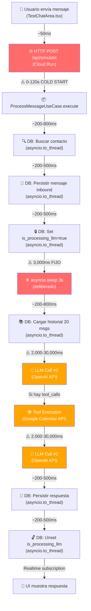

# Análisis de Latencia: ¿Por qué el Asistente Tarda 2-7 Minutos?

## Resumen Ejecutivo

Se identificaron **8 fuentes de latencia** distribuidas en 3 capas. En el peor caso (cold start + tool calls + Google Calendar), las demoras se acumulan hasta **2-7 minutos**.

---

## Diagrama de Flujo con Tiempos Estimados



---

## Las 8 Fuentes de Latencia

### 🔴 CAPA 1: Infraestructura (Cloud Run)

#### 1. Cold Start de Cloud Run
- **Impacto estimado: 30-120 segundos**
- **Archivo:** [Dockerfile](file:///d:/WebDev/IA/Backend/deploy/Dockerfile)
- **Causa:** El Dockerfile usa `python:3.11-slim` y el contenedor tiene que iniciar Uvicorn, cargar FastAPI, registrar tools, iniciar el event bus y el proactive worker. Cloud Run escala a 0 instancias cuando no hay tráfico. Cuando llega un request tras inactividad, debe provisionar un contenedor nuevo desde cero.
- **Agravante:** `--workers 1` en el CMD (línea 37 del Dockerfile) significa que solo hay un worker Uvicorn. Si ese worker está ocupado, los requests siguientes se encolan.

> [!CAUTION]
> **Este es probablemente el factor dominante.** El chat de pruebas se usa esporádicamente, lo que casi garantiza un cold start cada vez.

#### 2. Supabase Client sin Connection Pooling Real
- **Impacto estimado: 200-800ms por query**
- **Archivo:** [supabase_client.py](file:///d:/WebDev/IA/Backend/app/infrastructure/database/supabase_client.py)
- **Causa:** El `SupabasePooler` es un singleton que reutiliza una sola instancia de client. Pero la librería `supabase-py` usa REST API internamente (HTTP sobre PostgREST), no conexiones TCP persistentes a Postgres. Cada operación es un HTTP round-trip completo al servidor Supabase.

---

### 🟠 CAPA 2: Aplicación (Python Backend)

#### 3. `asyncio.sleep(3)` Deliberado
- **Impacto: 3,000ms FIJOS**
- **Archivo:** [use_cases.py:103](file:///d:/WebDev/IA/Backend/app/modules/communication/use_cases.py#L103)
```python
if not is_simulation: await asyncio.sleep(3)
```
- **Causa:** Este delay fue puesto intencionalmente para el flujo real de WhatsApp (evitar respuestas antes de que el usuario termine de escribir). Pero esta línea **NO afecta al Sandbox** porque `is_simulation=True` la salta.

> [!NOTE]
> Este delay solo aplica al flujo real de WhatsApp, no al chat de pruebas. No es la causa del problema en sandbox.

#### 4. Operaciones DB Secuenciales (6-8 queries en serie)
- **Impacto estimado: 1,200-5,000ms acumulados**
- **Archivo:** [use_cases.py](file:///d:/WebDev/IA/Backend/app/modules/communication/use_cases.py)
- **Causa:** Todas las operaciones de base de datos se ejecutan **secuencialmente** vía `asyncio.to_thread()`. Y varias de ellas podrían paralelizarse.

| # | Operación | Línea | Paralelizable? |
|---|-----------|-------|---------------|
| 1 | Buscar contacto | 42 | – (necesario primero) |
| 2 | Crear contacto (si nuevo) | 67 | – |
| 3 | Persistir mensaje inbound | 87 | ✅ Sí (con #4) |
| 4 | Set `is_processing_llm=True` | 101 | ✅ Sí (con #3) |
| 5 | Cargar historial | 110 | – (necesita contact_id de #1/#2) |
| 6 | Persistir respuesta | 156 | ✅ Sí (con #7) |
| 7 | Unset `is_processing_llm` | 165 | ✅ Sí (con #6) |

#### 5. Google Calendar API Sincrónica
- **Impacto estimado: 1,000-5,000ms por llamada**
- **Archivo:** [google_client.py](file:///d:/WebDev/IA/Backend/app/infrastructure/calendar/google_client.py)
- **Causa:** Todas las funciones de Google Calendar (`get_merged_availability`, `book_round_robin`, `delete_appointment`, `list_appointments`) están marcadas como `async` pero internamente usan la librería síncrona `googleapiclient`. No hay `await` real — bloquean el event loop del worker.
- **Agravante:** `get_service()` (línea 15-17) lee las credenciales del disco y construye el servicio en cada invocación, sin cache.

> [!WARNING]
> Estas funciones que dicen ser async pero usan I/O síncrono bloquean el **único worker** Uvicorn, congelando todo el servidor hasta que completen.

#### 6. Doble Invocación al LLM cuando hay Tool Calls
- **Impacto estimado: 4,000-60,000ms adicionales**
- **Archivo:** [use_cases.py:130-147](file:///d:/WebDev/IA/Backend/app/modules/communication/use_cases.py#L130-L147)
- **Causa:** Cuando el LLM decide usar una herramienta:
  1. **LLM Call #1** (línea 130): genera la decisión de tool call → 2-30s
  2. **Tool Execution** (líneas 136-143): ejecuta Google Calendar u otra tool → 1-5s
  3. **LLM Call #2** (línea 146): genera la respuesta final con los resultados → 2-30s

  Esto **triplica** el tiempo de respuesta comparado con una respuesta directa sin tools.

---

### 🟡 CAPA 3: LLM (OpenAI API)

#### 7. Latencia Intrínseca de la API de OpenAI
- **Impacto estimado: 2,000-30,000ms por llamada**
- **Archivo:** [openai_adapter.py](file:///d:/WebDev/IA/Backend/app/infrastructure/llm_providers/openai_adapter.py)
- **Variables:**
  - Largo del `system_prompt` (si es muy extenso, más tokens de entrada)
  - Largo del historial (hasta 20 mensajes, línea 109)
  - Número de tools registradas (7 tools con schemas JSON)
  - Modelo usado (e.g. `gpt-4o-mini` vs `gpt-4o`)
  - Carga de los servidores de OpenAI en el momento

#### 8. Frontend No Recibe Streaming
- **Impacto: latencia percibida**
- **Archivos:** [TestChatArea.tsx](file:///d:/WebDev/IA/Frontend/components/Conversations/TestChatArea.tsx), [use_cases.py](file:///d:/WebDev/IA/Backend/app/modules/communication/use_cases.py)
- **Causa:** El frontend muestra "IA Generando..." hasta que el mensaje completo llega vía Supabase Realtime. No hay streaming parcial. Esto maximiza la latencia **percibida** porque el usuario ve una animación estática durante todo el procesamiento.

---

## Peor Caso: Cómo se Llega a 7 Minutos

```
Cold Start Cloud Run .............. 120,000 ms (2 min)
DB: Buscar contacto ............... 800 ms
DB: Persistir inbound ............. 500 ms
DB: Set processing lock ........... 500 ms
DB: Cargar historial .............. 800 ms
LLM Call #1 (con 7 tools) ........ 30,000 ms (30s)
Tool: Google Calendar (sync I/O) .. 5,000 ms
LLM Call #2 (respuesta final) .... 30,000 ms (30s)
DB: Persistir respuesta ........... 500 ms
DB: Unset processing lock ......... 500 ms
Realtime propagation .............. 200 ms
─────────────────────────────────────────────
TOTAL ............................ ~188,800 ms (~3.1 min)
```

Con variabilidad de red y OpenAI saturado, fácilmente alcanza 5-7 minutos.

---

## Estrategias de Optimización (Ranking Impacto/Esfuerzo)

### 🟢 Alto Impacto / Bajo Esfuerzo

| # | Estrategia | Impacto Estimado | Esfuerzo | Detalle |
|---|-----------|-----------------|----------|---------|
| 1 | **Configurar `min-instances=1`** en Cloud Run | Elimina cold start (-120s) | ⭐ Mínimo | Un solo flag en el deploy. Costo: ~$5-10/mes por mantener 1 instancia siempre viva. |
| 2 | **Cache del servicio Google Calendar** | Evita reconstruir credenciales | ⭐ Mínimo | Mover `get_service()` a un singleton como el SupabasePooler. Ahorra ~200-500ms por tool call. |

### 🟡 Alto Impacto / Esfuerzo Moderado

| # | Estrategia | Impacto Estimado | Esfuerzo | Detalle |
|---|-----------|-----------------|----------|---------|
| 3 | **Paralelizar operaciones DB** | -500-2,000ms | ⭐⭐ | Usar `asyncio.gather()` para las operaciones de DB que no dependen entre sí (persist inbound + set processing, persist reply + unset processing). |
| 4 | **Envolver Google Calendar en `asyncio.to_thread`** | Desbloquea event loop | ⭐⭐ | Las calls sincrónicas a Google API bloquean el worker. Envolverlas en `to_thread` libera al event loop para atender otros requests. |

### 🟠 Alto Impacto / Esfuerzo Alto

| # | Estrategia | Impacto Estimado | Esfuerzo | Detalle |
|---|-----------|-----------------|----------|---------|
| 5 | **Dejar conectados modelos más rápidos** | -50-80% en latencia LLM | ⭐⭐⭐ | Evaluar conectar los modelos más rápidos disponibles entre OpenAI y Google revisando antes su desempeño y tiempos de respuesta según info. oficial y reportada por usuarios, docuemtnación oficial etc.  para mensajes simples, o Groq/Cerebras para latencia ultra-baja (~200ms). |
| 6 | **Implementar `asyncpg` directo** en vez de Supabase REST | -50-70% en latencia DB | ⭐⭐⭐ | Reemplazar las llamadas HTTP REST de `supabase-py` por conexiones directas TCP a Postgres, eliminando la capa PostgREST. |

### 🔵 Impacto Moderado / Ideas Complementarias

| # | Estrategia | Detalle |
|---|-----------|---------|
| 7 | **Respuestas en etapas** | El frontend tiene timeout de 30s ([TestChatArea.tsx:80](file:///d:/WebDev/IA/Frontend/components/Conversations/TestChatArea.tsx#L80)) pero el backend puede tardar mucho más. Esto se reduce drásticamente si se implementan respuestas parciales antes de la ejecución de herramientas (donde será vital que el asistente peuda enviar un segundo otercer (o n-ésimo) mensaje con el "resutlado" de por ejemplo: perfecto ahora agendaré. separado  de Te confirmo que ya quedó agendado / hubo un problema al utilziar herramienta etc. ( con o sin han-off a huamno según casos, etc)). |
| 8 | **Warm-up endpoint** | Crear un endpoint `/health` que cuando hayan usuarios interactuando activamente con el interfaz de usuario frontend (por ej al inciar sesión) se llame al endpoint para mantener la instancia caliente sin `min-instances`. Gratis pero menos confiable. Aunque esto se resuelve con el min-workers mayor o igual a uno no? creo que esto no es necesario. |


