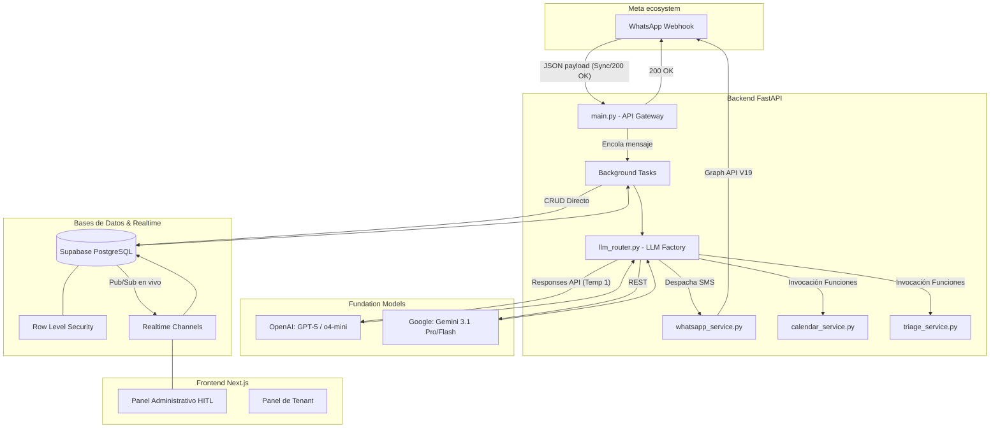

# WhatsApp AI CRM - Documentación de Arquitectura y Referencia Técnica

*Última revisión: 2026-03*

Este documento describe exhaustivamente la arquitectura, configuración, despliegue y detalles de implementación a nivel de archivo del sistema WhatsApp AI CRM. Este proyecto es una solución B2B multi-tenant que integra la conectividad con Meta (WhatsApp Cloud API) junto a motores de inteligencia artificial de última generación (GPT-5.4, o4-mini, Gemini 3.1) bajo un enfoque Human-In-The-Loop (HITL), orquestado sobre un backend hiper ruteado en Python (FastAPI) y un frontend reactivo en Next.js.

---

## 1. Visión General del Sistema

El ecosistema unifica comunicaciones de pacientes/clientes y la asistencia médica/comercial delegando la atención de primera línea a Modelos Fundamentales (LLMs). Está diseñado para evadir los límites de latencia estricta de Meta mediante un esquema asíncrono, persistiendo el estado en una base de datos distribuida en la nube (Supabase) que propaga instantáneamente los cambios a un panel administrativo donde agentes humanos pueden monitorear e intervenir.

### Componentes Clave
- **Integración Transaccional**: Recepción y despacho de mensajes de Meta en tiempo real usando APIs Graph v19.0.
- **Orquestador Multi-LLM**: Patrón de estrategias intercambiables que evalúan prompts y herramientas complejas según el proveedor seleccionado por la cuenta (tenant).
- **Herramientas Activas (Function Calling)**: El bot puede leer agendas bi-direccionales de Google Calendar (Round-Robin), modificar citas y ejecutar evaluaciones médicas preventivas (Triaje) para escalamiento a humanos.
- **Ecosistema Multi-tenant**: Aislamiento arquitectónico de base de datos usando RLS (Row Level Security) logrando que diferentes clínicas/negocios compartan el despliegue de software sin violar la privacidad de datos cruzados.

---

## 2. Diagrama de Arquitectura de Alto Nivel



---

## 3. Requisitos y Configuración de Entorno

### Requisitos del Sistema
- **Backend:** Python 3.11+
- **Frontend:** Node.js 18+ (App Router compatible).
- **Base de Datos:** Instancia activa de Supabase (PostgreSQL).
- **Otros:** Credenciales de Service Account de Google Desktop/Server para la API Calendar.

### Variables de Entorno (Backend `.env`)
El archivo `.env` en la raíz del Backend debe contener las siguientes variables operativas. **PRECAUCIÓN**: Las variables globales nunca deben inyectarse en los buckets de frontend público.

```env
# Conexión Base de Datos Administrativa (Bypassea RLS para escritura de fondo)
SUPABASE_URL=https://<tu_proyecto>.supabase.co
SUPABASE_SERVICE_ROLE_KEY=<tu_service_key_reservada>

# Proveedores de IA
OPENAI_API_KEY=sk-proj-...
GEMINI_API_KEY=AIza...

# Meta API
WHATSAPP_VERIFY_TOKEN=<tu_cadena_secreta_de_verificacion>

# Infraestructura local
ENVIRONMENT=development # o 'production'
MOCK_LLM=false # Útil para pruebas sin gastar cuota en API Keys
```

---

## 4. Guía de Inicio Rápido (Desarrollo local)

### Backend (Directorio `Backend/`)
El sistema está construido sobre `uvicorn` y `fastapi`.
1. Asegura poseer el entorno virtual instalado y haz `pip install -r requirements.txt`.
2. Para levantar el servidor con recarga automática:
   ```bash
   uvicorn main:app --reload --port 8000
   ```
   *Nota: Por diseño, el entorno local de backend no puede recibir peticiones web directas de Meta a menos que se exponga mediante túneles (ej. Ngrok/Cloudflare Tunnels).*

### Frontend (Directorio `Frontend/`)
1. Agrega el `.env.local` con `NEXT_PUBLIC_SUPABASE_URL` y `NEXT_PUBLIC_SUPABASE_ANON_KEY`.
2. Ejecuta la instalación y levantamiento del server React.
   ```bash
   npm install && npm run dev
   ```

---

## 5. Arquitectura del Frontend (Referencia Breve)

El Frontend, construido en **Next.js**, actúa unicamente como una ventana en vivo al estado de la base de datos de Supabase. A diferencia de las arquitecturas clásicas SPA (Single Page Applications) que sondean el backend cada x segundos (polling), este CRM no realiza tráfico contínuo de lectura hacia FastAPI.

- **Manejo de Estados Vivos**: Transmite inmediatamente los cambios y nuevos mensajes a traves del websocket provisto por Supabase Realtime Channels.
- **Gestión Human-In-The-Loop**: Cuando un agente clíquea el botón "Intervenir / Pausar Bot", el Front actualiza la columna `bot_active=False` del contacto en Supabase. El Backend (FastAPI), que revisa rutinariamente esta bandera por cada nuevo webhook ingresado, cortará el ruteo hacia la IA. El humano luego redacta manualmente las respuestas enviando transacciones a FastAPI vía rutas internas a través de supabase que luego gatillan triggers/edges, o interactuando asombrosamente de forma directa como otro componente emisor que escribe al endpoint de Graph API.
- **Renderizado Dinámico de Roles (POV)**: La UI interpreta el rol (`sender_role`) y el contacto seleccionado para orientar el chat (izquierda vs derecha):
  - *Contactos de Clientes (Normal)*: Mensajes del usuario/paciente alineados a la izquierda. Respuestas de IA o staff humano alineadas a la derecha (estándar CRM).
  - *Buzón de Alertas y Chat de Prueba*: En los paneles internos ("Chat de Prueba (Tú)" o "Alertas Sistema 🚨"), la cámara se *invierte* forzando a percibir al sistema/IA como externo (izquierda) y a nosotros mismos como interactuantes orgánicos (derecha).

---

## 6. Arquitectura del Backend (FastAPI) [Núcleo Crítico]

El directorio `D:\WebDev\IA\Backend\` aloja el verdadero cerebro del proyecto CRM. No es tan solo un puente pasivo, sino un actor de negocio autónomo. 

### Ciclo de Vida de un Mensaje (Paso a Paso)

1. **Recepción Webhook (`main.py: @app.post("/webhook")`)**:
   - Ingresa carga JSON masiva desde servidores de Meta (Facebook).
   - Valida superficialmente la estructura (ignora eventos sin SMS o comprobantes de lectura).
   - Deriva el `phone_number` y el `phone_id` a un hilo de procesamiento en el fondo vía `BackgroundTasks`. 
   - **Crítico**: Retorna `HTTP 200 OK` en el acto al Webhook. Meta impone un agresivo tiempo de inamovilidad y descarta/bloquea servidores lentos.

2. **Procesamiento de Fondo (`process_whatsapp_message`)**:
   - Lee la BD para ligar el `ws_phone_id` al ecosistema (Tenant). Sin Tenant, muere.
   - Resuelve la existencia del contacto basándose en su `phone_number`.
   - Si `contact.bot_active` es Falso (HitL), termina. Si está Activo, sigue.
   - Extrae el historial (últimos 10 chats) de Supabase, ordenándolos cronológicamente.

3. **Invocación LLM (`llm_router.py`)**:
   - El `LLMFactory` lee los metadatos del tenant y deriva al modelo específico.
   - Inyecta `system_prompt` modificado con estado actual y el array de herramientas.
   - Si la IA invoca llamar funciones (Function Calling), como revisar vacantes, se ejecuta código del Backend que retorna el resultado JSON a los historiales y relanza la invocación hacia el LLM.

4. **Tránsito Final (`whatsapp_service.py`)**:
   - IA decide emitir respuesta final (texto).
   - FastAPI guarda la respuesta del "assistant" en tabla `messages`.
   - Lanza petición HTTP contra `graph.facebook.com/v19.0` para entregar el WhatsApp.

---

## 7. Inventario Exhaustivo de Archivos del Backend

Esta es la cartografía precisa de lo que hay alojado en la raíz del Backend, separando lógicamente los archivos de núcleo contra la basura o artefactos de tests empíricos.

### A. Archivos del Core y Servicios (Código en Producción)

1. **`main.py`**: El portón delantero y servidor central. Expone utilitarios CORS globalizados, alberga el interceptor GET de habilitación de Webhooks, el procesador principal, lógica de base de datos directa (`supabase-py`) y expone 3 endpoints públicos de APIs extra (consultas calendario abiertas).

2. **`llm_router.py`**: Fábrica y Estrategias (Design Pattern).
   - **`LLMStrategy`** (Abstract): Firma `generate_response`.
   - **`OpenAIStrategy`** / **`GPT5MiniStrategy`**: Usan el nuevo SDK Async de OpenAI, procesan el bucle lógico para function calls. Estrictamente controlan flujos que fallan cuando temperature != 1 según designio de OpenAI o4-mini/gpt-5.
   - **`GeminiStrategy`**: Maneja el SDK `google.generativeai` y sus configuraciones de tools.
   - Contiene la valiosa función `send_and_log_staff_notification` usada para inyectar fallas y alertas artificiales a las interfaces.

3. **`calendar_service.py`**: Intercomunicador central de negocio de reservas.
   - **Cuentas**: Exige archivo JSON físico de cuenta de servicio GCP (`casavitacure-crm-1b7950d2fa11.json`). 
   - **Lógica de Doble Agenda**: Soporta agendamiento "Round-Robin", combinando lecturas asíncronas de un Box 1 y Box 2 para agendar el que esté libre, bloqueando choques de citas ("Overlaps").
   - **Herramientas**: Expone variables enormes y fuertemente tipificadas (`CALENDAR_TOOLS_OPENAI`) representando el DSL (Domain Script Language) que los parsers LLM consumen para entender qué significa y cómo solicitar cosas del calendario.
   - *Precaución*: Borrar un turno (`delete_appointment`) y otras lógicas, auditan estrictamente si el `phone_number` del contacto de la base de datos calza con el inyectado al final de la descripción del evento crudo de Google. Si fallan las comparaciones, se desestima, logrando inmunidad ante citas erróneas.

4. **`triage_service.py`**: Inteligencia clínica separada. 
   - Invoca una interrupción suave de flujo. Si la IA percibe peligro médico, llama a `derivar_evaluacion_medica`. Este archivo desactiva `bot_active` en backend preventivamente y clona mensajes especiales hacia un contacto virtual en base de datos llamado `Alertas Sistema 🚨` (o al teléfono general de guardia `+56999999999`).

5. **`whatsapp_service.py`**: Capa delgada que monta payloads nativos de Meta WhatsApp y lanza el fetch final de manera puramente asíncrona (`httpx.AsyncClient`) con tiempo de retención de 10s.

6. **`logger.py`**: Reemplazo general de `print`. Setea el comportamiento de stdout colorizado/formatado.

7. **`casavitacure-crm-1b7950d2fa11.json`**: Clave cruda perimetrada provista por Google Cloud para `calendar_service`. De extrema sensibilidad. Jamás ser controlada por Git (Asegurar estar en `.gitignore`).

---

### B. Scripts de Configuración, Mantenimiento y Setup de Base de Datos

Existen rutinas diseñadas como 'Operaciones Manuales' que no forman parte de ningún subproceso activo del servidor FastAPI pero son esenciales para el desarrollador que orqueste la infraestructura en Supabase. Se deben ejecutar usando sintaxis normal `python script.py`.

8. **`db_setup.py`**: Genera la inyección inicial semilla del Tenant maestro. Útil para levantar entornos de 0 local tras correr archivos `schema.sql`.

9. **`enable_rt.py`**: Ejecutable crucial. Dado que Supabase limita la redifusión de tablas completas por real-time vía pub/sub al vacío o a RLS, este parche de consola activa y empuja la alteración (`alter publication supabase_realtime add table "messages"`) necesaria para conectar Frontend.

10. **`fix_pub_pooler.py` / `fix_rls.py`**: Herramientas complementarias para afinar variables de concurrencia y mutar políticas PostgreSQL directas de Row Level Security evadidas o ausentes en revisiones iniciales.

11. **`migrate_contacts.py` / `delete_contacts.py`**: Comandos cronometrados destructivos de limpieza en cascada ("Hard Delete"). `delete_contacts` borra tablas de historiales y mensajes vacíos. Útiles antes de despliegues.

---

### C. Scripts de Laboratorio (Testing Empírico, Debug y Mocking)

El directorio raíz abusa actualmente de mantener archivos transitorios usados por desarrolladores para forzar eventos sin depender del webhook de Meta (o debido a falta de test automatizados como Jest/Pytest).

12. **`check_db.py` / `check_contacts.py` / `check_contacts2.py` / `debug_db.py`**: Visores tontos que extraen rows rápidos mediante queries crudos a Supabase y los imprimen en formato tabular por terminal. Usado para constatar visualmente si FastAPI persistió datos.

13. **`test_bot.py` / `test_gpt5.py`**: Emuladores crudos de CLI que obvian la base de datos (y la web) e inician una conversación temporal aislada contra el proveedor de OpenAI o Google usando la API key cruda.

14. **`test_gpt5_tools.py`**: Validadores complejos que prueban si la función interna parsea y retorna de ida/vuelta exitosamente resultados falsos del calendario contra el modelo.

15. **`debug_gpt5_tools.py` / `test_history.py`**: Trazas de análisis sobre límites de tokens y parseo de historiales masivos que revisan colisiones al montar arrays al LLM.

16. **`out.txt`**: Fichero de salida chatarra para volcados densos de consola (probablemente producto de testing previo).

---

## 8. Consideraciones de Seguridad y Precauciones

- **Evitar bucles infinitos en AI**: Actualmente, un error en `llm_router.py` en parsing iterativo puede trabarse en calls infinitas. Modificaciones en el parser de roles deben hacerse con precisión absoluta (por ej., las API de GPT requieren que cada llamado de Assistant contenga siempre respuesta `tool_calls` apareada orgánicamente de la respuesta `tool` enviada de retorno).
- **CORS General Abierto**: En `main.py`, actualmente tenemos `allow_origins=["*"]`. Debe auditarse y cambiarse asincronamente si se lanza en Cloudflare/Vercel producciones rigurosas.
- **Rutas públicas en Main `api/public/`**: Los endpoints de calendario web estático no tienen RLS ni firewall salvo un rate límiter natural.
- **Acoplamiento Fuerte**: El código está atado al prefijo internacional chileno `+56` y ciertos enrutamientos manuales como el número de alerta en Triage. Deben reemplazarse a futuro por variables dinámicas asociadas al contexto del `Tenant`.

---

## 9. Propuesta de Refactorización Física (Deuda Técnica)

> **Nota Adjudicada al Desarrollo Futuro del Proyecto**
> La documentación arriba descrita refleja en total exactitud la disposición física local de archivos del entorno. Sin embargo, dicha horizontalidad en la cual lógica de negocio y configuraciones de una vez conviven en el mismo plano genera fricción y rompe estándares modernos (e.g., *Screaming Architecture*).

Se propone al equipo de desarrollo adoptar e implementar la siguiente estructura escalable antes de continuar construyendo ramas funcionales nuevas:

```text
Backend/
├── app/
│   ├── core/
│   │   ├── __init__.py
│   │   ├── main.py                    # Gateway, Webhooks y Endpoints Web Reales
│   │   ├── config.py                  # Pydantic Settings para cargar variables de entorno
│   │   ├── logger.py                  # Formatter del ecosistema
│   │   └── llm_router.py              # Fábricas y routers.
│   │
│   └── services/
│       ├── __init__.py
│       ├── calendar_service.py        # Dominio externo Calendar
│       ├── triage_service.py          # Lógica interna salud y pausas
│       └── whatsapp_service.py        # Capa REST a Meta
│
├── scripts/
│   ├── setup/
│   │   ├── db_setup.py
│   │   ├── enable_rt.py
│   │   ├── fix_rls.py
│   │   └── fix_pub_pooler.py
│   │
│   └── maintenance/
│       ├── check_db.py
│       ├── (otros check_*, migrate_*, delete_*.py)
│
├── tests/                             # Sustituye empíricos (test_*) por pytest
│   ├── manual/                        # Antiguos emuladores de consola
│   └── unit/
│
├── credentials/
│   └── casavitacure-crm-1b7950d2fa11.json  (O env secrets base64)
│
├── .env
├── .gitignore
├── requirements.txt
└── README.md
```

Hacer esta migración requerirá únicamente reordenar e importar los prefijos relativos correctos de lado a lado en los archivos `main.py` y resolver las rutas relativas en la carga del `logger`. Aumentará instantáneamente la profesionalidad y aislamiento de errores operacionales manuales ("fat finger execution errors").
